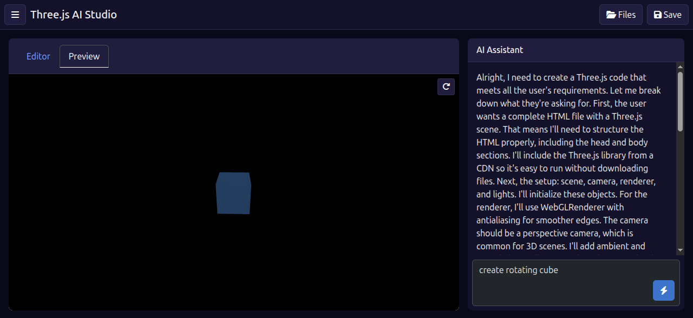

# Three.js AI Studio
---

---
Three.js AI Studio is a modern, web-based development environment designed to accelerate the creation and testing of [Three.js](https://threejs.org/) scenes. It leverages AI to generate, debug, and fix code, providing a seamless workflow from idea to interactive 3D preview.

The studio is built as a single-page application with a backend powered by Cloudflare Workers, making it fast, scalable, and easy to deploy.

## Key Features

- **AI Code Generation**: Describe a 3D scene in plain English and let the AI generate the complete Three.js code for you.
- **AI-Powered Debugging**: When your code has an error, the AI can analyze the error message and the code to provide a fix.
- **Rich IDE Experience**: A Firebase Studio-inspired layout with a code editor, file explorer, and interactive panel controls.
- **Live Preview**: Instantly see the results of your code in a live preview tab.
- **Off-canvas Navigation**: A clean, spacious interface with collapsible sidebars for main navigation and file management.
- **Cloud-Based Workspace**: User authentication and file storage are handled in the cloud (using Cloudflare R2), so your projects are saved and accessible.

## Tech Stack

- **Frontend**:
  - HTML5
  - Bootstrap 5 for layout and components.
  - vanilla-js for all client-side logic.
  - Font Awesome for icons.

- **Backend**:
  - [Cloudflare Workers](https://workers.cloudflare.com/) for serverless application logic.
  - [Cloudflare R2](https://developers.cloudflare.com/r2/) for file storage.
  - [Cloudflare KV](https://developers.cloudflare.com/workers/runtime-apis/kv/) for user authentication storage.
  - [Cloudflare Workers AI](https://developers.cloudflare.com/workers-ai/) for AI-powered code generation and fixing (via the Llama 3 model).
  - [Wrangler CLI](https://developers.cloudflare.com/workers/wrangler/) for development and deployment.

## Project Structure

```
.
├── backend/        # Cloudflare Worker code
│   ├── src/
│   │   ├── auth.js
│   │   ├── code-generator.js
│   │   ├── index.js        # Main worker entrypoint
│   │   └── workspace.js
│   ├── package.json
│   └── wrangler.toml     # Worker configuration
│
└── frontend/       # SPA frontend
    └── index.html      # The entire frontend application
```

## Getting Started

### Prerequisites

- [Node.js](https://nodejs.org/) and npm.
- [Wrangler CLI](https://developers.cloudflare.com/workers/wrangler/install-and-update/) installed and authenticated with your Cloudflare account.

### Backend Setup

1.  Navigate to the `backend` directory:
    ```bash
    cd backend
    ```
2.  Install dependencies:
    ```bash
    npm install
    ```
3.  **Configure `wrangler.toml`**: This file is crucial. You must create the necessary Cloudflare services and link them in this file.
    - **AI**: Enable the Workers AI add-on for your account. The binding is already named `AI`.
    - **R2 Buckets**: Create two R2 buckets (e.g., `three-ai-workspaces` and `three-ai-files`) and update their `bucket_name` in the `[[r2_buckets]]` sections.
    - **KV Namespace**: Create a KV namespace (e.g., `THREE_AI_USERS`) and update its `id` in the `[[kv_namespaces]]` section.

4.  Run the worker locally for development:
    ```bash
    wrangler dev
    ```
    This will start a local server, typically at `http://localhost:8787`.

### Frontend Setup

1.  The frontend is a single static file: `frontend/index.html`.
2.  For local development, you can open it directly in your browser. However, due to CORS policies, it is recommended to serve it via a simple local HTTP server. A tool like `http-server` can be used:
    ```bash
    # install it if you don't have it
    npm install -g http-server
    
    # from the project root, run:
    http-server frontend
    ```
3.  **IMPORTANT**: In `frontend/index.html`, find the `API_BASE` constant and ensure its URL points to your running backend (e.g., `http://localhost:8787` for local development or your deployed worker URL for production).

## How to Use

1.  **Register/Login**: Create an account or log in. Your session is persisted in local storage.
2.  **Generate Code**: Use the AI Assistant panel on the right. Type a prompt (e.g., "create a spinning red cube") and click "Generate". The AI will generate the code and it will appear in the editor, with the preview tab automatically opening.
3.  **Manage Files**: Use the "Files" button in the header to open the file explorer. You can create new files, open existing ones, and delete them.
4.  **Edit and Preview**: Manually edit code in the "Editor" tab. Click the "Preview" tab to see your changes live.
5.  **Fix Errors**: If the preview shows an error, a "Fix with AI" button will appear. Click it, and the AI will attempt to fix your code based on the error message.
6.  **Save Your Work**: Click the "Save" button in the header to save the currently open file.
